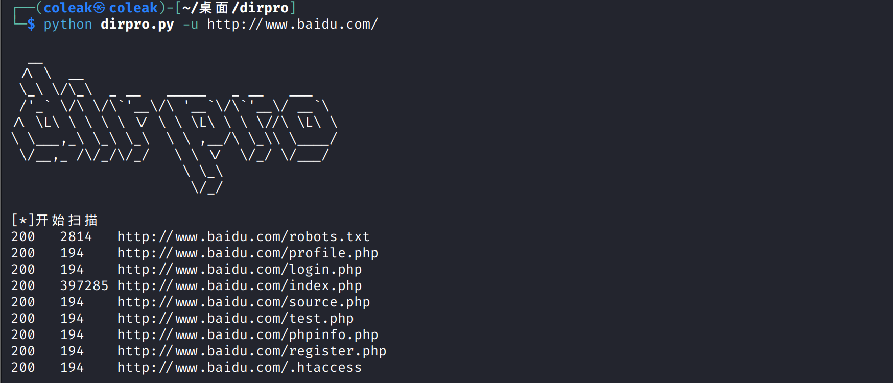

# 1.简介

- dirpro 是一款由 python 编写的目录扫描器，操作简单，功能强大，高度自动化
- 自动根据返回状态码和返回长度，对扫描结果进行二次整理和判断，准确性非常高




**已实现功能**

- [x] 可自定义扫描线程
- [x] 导入url文件进行批量扫描并分别保存结果
- [x] 状态码429检测，自动退出程序并提示设置更小的线程
- [x] 每扫描10%自动显示扫描进度
- [x] 可自定义扫描字典文件
- [x] 可自定义代理流量
- [x] 自动使用随机的User-Agent
- [x] 自动规范输入的目标url格式，根据输入的url动态生成敏感目录
- [x] 强大的默认字典top10000
- [x] 自动根据返回状态码和返回长度对扫描结果进行二次整理和判断
- [x] 扫描结果自动生成 域名+时间 格式的防同名文件名 并保存到scan_result目录中


# 2. 安装

```
git clone https://github.com/coleak2021/dirpro.git
pip3 install -r requirements.txt
```


# 3.使用说明

## 3.1 扫描参数

```
options:
  -h, --help  show this help message and exit
  -u U        url
  -t T        thread:default=30
  -w W        dirfile path
  -a A        proxy,such as 127.0.0.1:7890
  -b          fastly to find backup files and sensitive files
```


## 3.2 参数详解

- -u 目标url
- -t 设置扫描线程，默认30
- -w 自定义扫描使用的字典文件
- -a 设置代理，格式为ip:端口
- -b 快速扫描目标的备份文件和源码泄露文件


## 3.3常见用法

- 默认扫描,使用默认的top10000目录字典进行扫描

```
python dirpro.py -u http://xxx.xxx.xxx.xxx
```


- 快速扫描备份文件和源码泄露文件

```
python dirpro.py -u http://xxx.xxx.xxx.xxx -b
```


- 自定义目录字典文件

```
python dirpro.py -u http://xxx.xxx.xxx.xxx -w wordlist.txt
```


- 设置代理流量扫描

```
python dirpro.py -u http://xxx.xxx.xxx.xxx -a 127.0.0.1:7890
```


- 设置线程

```
python dirpro.py -u http://xxx.xxx.xxx.xxx -t 10
```


- 设置url文件

```
python dirpro.py -f urls.txt
```

urls.txt文件格式为每行一个url，例如：

```
http://xxx.xxx.xxx.aaa
http://xxx.xxx.xxx.xxx:6677
https://xxx.xxx.xx
```


- 参数组合

```
python dirpro.py -u http://xxx.xxx.xxx.xxx -w wordlist.txt -a 127.0.0.1:7890 -t 10
```


# 4.更新记录

**dirpro v1.1**

```
1.修复了文件名可能存在特殊符号导致保存失败的问题
2.新增状态码429检测，自动退出程序并提示设置更小的线程
```

**dirpro v1.2**

```
1.新增导入url文件进行批量扫描并分别保存结果功能
```


# 5.声明

- 本工具仅用于个人安全研究学习。由于传播、利用本工具而造成的任何直接或者间接的后果及损失，均由使用者本人负责，工具作者不为此承担任何责任。
